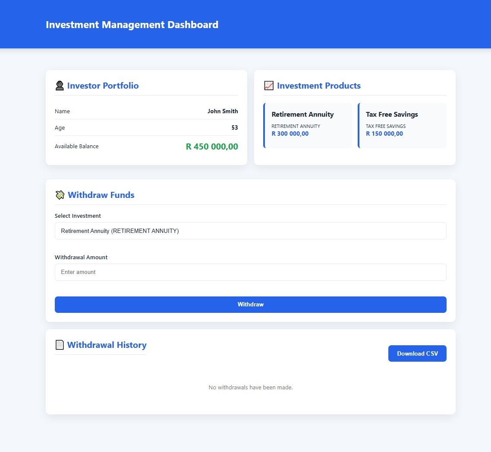
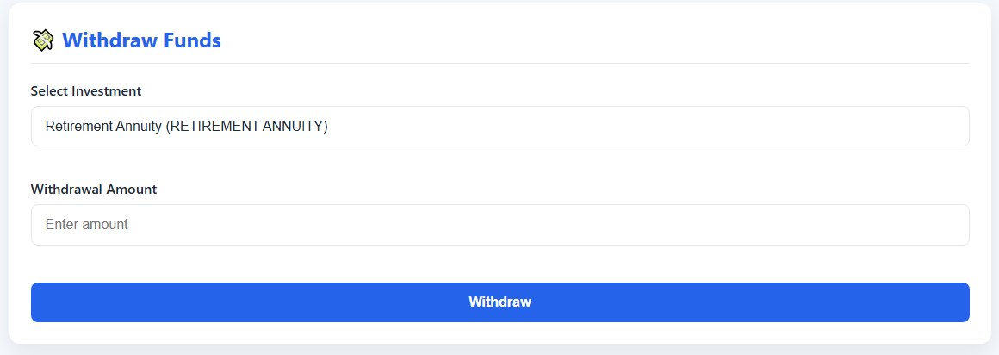
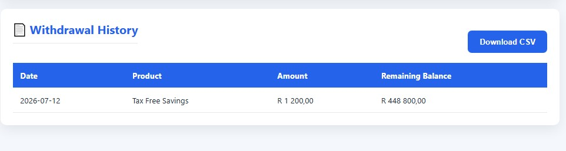
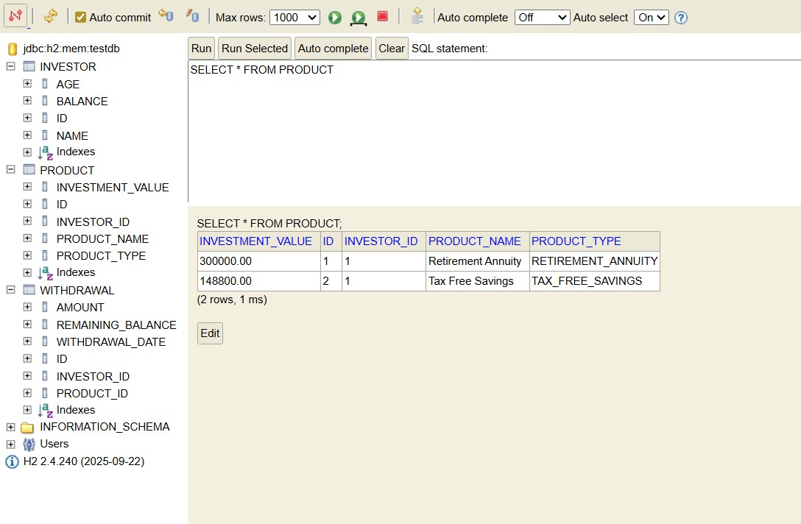

<div align="center">

# 💼 Investment Management System

<p>
A full-stack <strong>Investment Management System</strong> built with
<strong>Spring Boot</strong> and <strong>React</strong>.
</p>

<p>
Manage investor portfolios, perform investment withdrawals, enforce business rules,
track withdrawal history, and export transactions as CSV.
</p>

<p>


</p>

</div>

---

# 📖 Overview

The Investment Management System is a full-stack web application that allows investors to manage their investment portfolio through an intuitive dashboard.

The application enables users to:

- View an investor portfolio
- View investment products
- Select an investment product
- Perform withdrawals
- Enforce investment business rules
- View withdrawal history
- Export withdrawals to CSV

The project demonstrates practical software engineering concepts including RESTful API development, layered architecture, frontend integration, validation, exception handling, and database interaction.

---

# ✨ Features

<table>
<tr>

<td width="50%">

## 🔧 Backend

- Spring Boot REST API
- Layered Architecture
- Spring Data JPA
- H2 Database
- Bean Validation
- Global Exception Handling
- Swagger/OpenAPI
- CSV Export
- Business Rule Validation

</td>

<td width="50%">

## 🎨 Frontend

- Responsive Dashboard
- Portfolio Overview
- Investment Products
- Product Selection
- Withdrawal Form
- Withdrawal History
- CSV Download
- Axios API Integration

</td>

</tr>
</table>

---

# 📋 Business Rules

## 🏦 Retirement Annuity

- Investor must be **older than 65 years**
- Withdrawal cannot exceed **90%** of the investment value

---

## 💰 Tax Free Savings

- Available regardless of investor age
- Withdrawal cannot exceed **90%** of the investment value

---

## ✅ General Rules

- Withdrawal cannot exceed the selected investment value
- Investor portfolio balance is updated
- Selected investment value is updated
- Every successful withdrawal is recorded
- Withdrawal history can be exported to CSV

---

# 🛠 Technology Stack

| Backend | Frontend |
|----------|----------|
| Java 23 | React |
| Spring Boot | Vite |
| Spring Data JPA | Axios |
| Maven | CSS3 |
| H2 Database | JavaScript |
| Swagger | Responsive UI |

---

# 🏗 System Architecture

```text
                    React Frontend
                           │
                      Axios HTTP
                           │
                           ▼
                 Spring Boot REST API
                           │
          ┌────────────────┴────────────────┐
          ▼                                 ▼
     Service Layer            Global Exception Handler
          │
          ▼
    Repository Layer
          │
          ▼
       H2 Database
```

---

# 📂 Project Structure

```text
Investment-Management-System
│
├── backend
│   ├── config
│   ├── controller
│   ├── dto
│   │   ├── request
│   │   └── response
│   ├── entity
│   ├── exception
│   ├── repository
│   ├── service
│   └── util
│
├── frontend
│   ├── components
│   ├── pages
│   ├── services
│   ├── utils
│   └── assets
│
├── screenshots
│
└── README.md
```

---

# 🚀 Running the Project

<details open>

<summary><strong>Backend</strong></summary>

Navigate to the backend folder.

```bash
cd backend
```

Run the application.

```bash
./mvnw spring-boot:run
```

or

```bash
mvn spring-boot:run
```

Backend URL

```
http://localhost:8080
```

</details>

---

<details open>

<summary><strong>Frontend</strong></summary>

Navigate to the frontend folder.

```bash
cd frontend
```

Install dependencies.

```bash
npm install
```

Run the application.

```bash
npm run dev
```

Frontend URL

```
http://localhost:5173
```

</details>

---

# 💾 H2 Database

Access the H2 Console

```
http://localhost:8080/h2-console
```

### Configuration

```
JDBC URL
jdbc:h2:mem:testdb

Username
sa

Password
(blank)
```

---

# 📚 API Documentation

Swagger UI

```
http://localhost:8080/swagger-ui/index.html
```

---

# 🔗 API Endpoints

## Investor

| Method | Endpoint | Description |
|---------|----------|-------------|
| GET | `/api/investors/{id}` | Retrieve investor portfolio |

---

## Withdrawals

| Method | Endpoint | Description |
|---------|----------|-------------|
| POST | `/api/withdrawals` | Process withdrawal |
| GET | `/api/withdrawals` | Retrieve withdrawal history |
| GET | `/api/withdrawals/export` | Export withdrawals to CSV |

---

# 📨 Sample Request

```json
{
    "investorId": 1,
    "productId": 1,
    "amount": 5000
}
```

---

# 📥 Sample Response

```json
{
    "id": 1,
    "productId": 1,
    "productName": "Retirement Annuity",
    "productType": "RETIREMENT_ANNUITY",
    "amount": 5000,
    "remainingBalance": 445000,
    "withdrawalDate": "2026-07-11",
    "message": "Withdrawal processed successfully."
}
```

---

# 🔄 Application Workflow

```text
Load Investor
      │
      ▼
Display Portfolio
      │
      ▼
Select Investment Product
      │
      ▼
Enter Withdrawal Amount
      │
      ▼
Backend Validation
      │
      ▼
Update Investment
      │
      ▼
Update Portfolio
      │
      ▼
Save Withdrawal
      │
      ▼
Refresh Dashboard
      │
      ▼
Export CSV (Optional)
```

---

# 📸 Screenshots

## Dashboard

<p align="center">



</p>

---

## Withdrawal Form

<p align="center">



</p>

---

## Withdrawal History

<p align="center">



</p>

---

## H2 Database

<p align="center">



</p>

---

# 🎯 Learning Outcomes

This project demonstrates practical experience with:

- REST API Development
- Layered Software Architecture
- DTO Design
- Entity Relationships
- Spring Data JPA
- Bean Validation
- Exception Handling
- React Components
- Axios Integration
- Responsive UI Design
- CSV File Generation
- Full Stack Development

---


# 👨‍💻 Author

**Desire Gwanzura**

Full Stack Software Developer

📧 Email: **gwanzuradesire@gmail.com**

🌐 Portfolio: **https://guankid.github.io/Portfolio/**

💼 LinkedIn: **https://www.linkedin.com/in/desire-gwanzura/**

🐙 GitHub: **https://https://github.com/GuanKid**

---

<div align="center">

### ⭐⭐⭐⭐⭐
</div>
